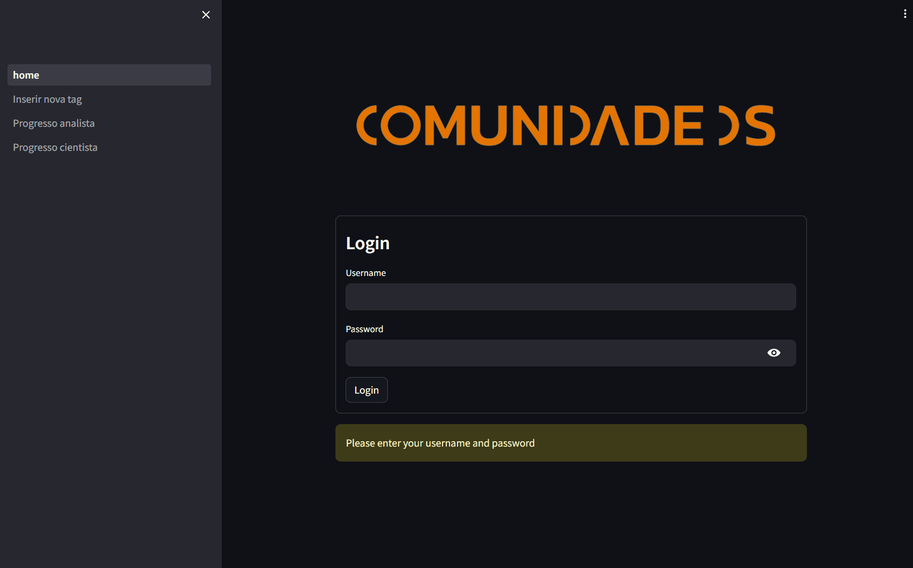
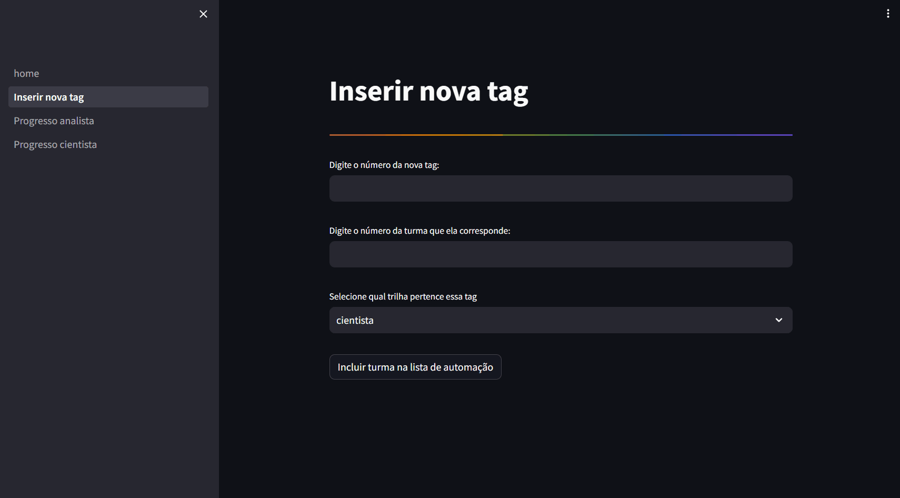

# Projeto Monitoramento de Aprendizado

Este projeto foi desenvolvido para a empresa Comunidade DS, através de um vínculo por uma empresa Jr.

Ele possui duas entregas principais:

- <u>**ETL :**</u> Responsável pela extração dos dados da plataforma de ensino, manipulação e carga em tabelas dentro do GCP (Google Cloud Platform)

- <u>**Dashboard :**</u> Painel para interação com o usuário utilizando a plataforma Streamlit, onde será possivel o acompanhamento do progresso dos alunos.

O projeto foi feito desenvolvido em colaboração entre os cientistas da dados [Daniel Salvatori](https://github.com/Daniel-Salvatori) e [Michele Lopes](https://github.com/MicheleLopes). 

Aqui você pode encontrar toda estrutura do código original, com algumas alterações devido a presença de dados sensíveis.

# 1. Problema de Negócio

A [Comunidade DS](https://www.comunidadeds.com/) é uma empresa de educação cujo objetivo é a capacitação de pessoas para o mercado de trabalho na área de dados. Por meio de uma assinatura o aluno tem acesso a todo conteúdo gravado de acordo com a produto contratado. Esse conteúdo é disponibilizado para os alunos através da plataforma da [Cademi](https://cademi.com.br/).

Após alguns anos inserida no mercado, a empresa decidiu reformular sua estrutura de ensino. Os alunos, que anteriormente estudavam de forma autônoma, foram organizados em turmas, cada uma sob a responsabilidade de um tutor. Estes tutores são encarregados de acompanhar o progresso dos alunos nas disciplinas, identificar dificuldades e manter uma relação próxima com a instituição, a fim de prevenir possíveis cancelamentos de assinaturas.
 
Diante dessa mudança, o acompanhamento do progresso dos alunos tornou-se fundamental para avaliar o avanço na trilha de aprendizado. A plataforma de ensino (Cademi) dispõe de uma ferramenta em seu site que permite consultar essas informações por meio do e-mail do aluno. No entanto, esse processo é manual, exigindo que o tutor acesse os dados de cada aluno individualmente, o que se mostrou inviável devido à morosidade na coleta das informações.

O objetivo desse projeto é extrair os dados da plataforma e unificá-los em 2 tabelas (uma para cada trilha de formação), a partir daí desenvolver uma painel em que os tutores poderão acompanhar o progresso dos alunos ao longo das semanas. Esses dados deverão ser atualizados semanalmente onde será possivel visualizar a jornada de cada aluno ao longo das disciplinas, ele servirá como um guia para o tutor identificar se o aluno esta atingindo o progresso previsto e entender possíveis situações que podem estar afetando seu rendimento. O painel deve estar disponível através de um link que poderá ser acessado pelos colaboradores da empresa por meio de um usuário e senha afim de garantir a integridade das informações.

# 2. Planejamento da Solução

Para planejamento da solução utilizamos o método **SAPE** (acrônimo de Sáida, Processo, Entrada), que servirá como um guia para execução do projeto.

<u>**Saída:**</u> Entrega de um painel de visualização em streamlit para acompanhamento do progresso dos alunos ao longo das disciplinas.

<u>**Processo:**</u> Extrair os dados da plataforma de ensino, armazená-los e criar um painel para visualização desses dados.

<u>**Entrada:**</u> Os dados são disponibilizados via API pela plataforma de ensino. Será criado um ETL cuja função é coletar e armazená-los em tabelas dentro do BigQuery Google Cloud. Com os dados coletados e armazenados será entregue um painel de visualização para acompanhamento do progresso dos alunos.

# 3. Descrição dos dados
A plataforma Cademi disponibiliza uma API onde é possível ter acesso as informações necessárias para execução do projeto.
Foram utilizados 2 endpoints para acesso aos dados:

### **Listar alunos por Tag:**

Retorna uma lista de usuários associados a uma tag específica. Essa coleta permite ter acesso as turmas que precisamos realizar o acompanhamento do progresso semanal.

**Método:** <mark>`GET`</mark>

**URL:** `/usuario/lista_por_tag/{tag_id}`

**Resposta:**

    "usuario":
        {
            "id": 1051,
            "nome": "Joana C",
            "email": "teste@oculto.com.br",
            "doc": "123.123.123-12",
            "celular": null,
            "login_auto": "http://membros.dvp/auth/login?crstk=",
            "gratis": false,
            "criado_em": "2020-01-12 19:59:20",
            "ultimo_acesso_em": null
        }

### **Listar Progresso por Aluno e Produto**

Retorna o progresso de um usuário em um determinado curso. Essa coleta permite extrair a informação de progresso necessária para o painel de acompanhamento do progresso

**Método:** <mark>`GET`</mark>

**URL:** `/usuario/progresso_por_produto/{usuario_email_id_doc}/{produto_id}`

Resposta:

    "progresso":
         {
            "total":"41.7%",
            "assistidas":7,
            "completas":5
         }

# 4. Estrutura do ETL

O ETL será responsável pela extração dos dados da plataforma Cademi, onde serão serão tratados e posteriormente armazenados dentro de tabelas no BigQuery Google Cloud.

O fluxograma abaixo representa a estrutura final do projeto, desde a extração dos dados até a interação com o usuário final.

Segue abaixo um descritivo de como funcionam as interações do ETL:

 - Inicialmente é feito a extração dos dados da plataforma da Cademi por meio de uma API. Para isso como entrada é necessário informar tags das turmas, onde a API irá retornar uma lista de alunos e informações de contato.

 - Com essa informação é realizado uma segunda solicitação via API, onde como entrada é fornecido a lista de alunos que a Cademi retornou e em conjunto uma tabela com os produtos que gostaríamos de extrair o progresso. Esses dados do progresso são armazenados dentro do nosso banco de dados a fim de armazenar o histórico do progresso.

 - Para interação com o usuário, foi criado um dashboard no streamlit, que consulta o banco de dados do GCP e retorna uma visualização dos dados de progresso de uma forma interativa de acordo com os filtros selecionados. Além disso o streamlit também possui uma tela onde o coordenador de ensino poderá inserir novas tags para entrarem nas próximas coletas de turmas da API. Essa implementação valida se a tag existe dentro da plataforma de ensino e insere na tabela para as proximas coletas. Isso traz autonomia para os usuários sem a necessidade de alterações no codigo.

 - O APP do streamlit é disponível para acesso de forma web e poderá ser acessado através de credenciais fornecidas pela empresa.

# 5. Painel do streamlit

Como produto final foi elaborado um painel na plataforma do streamlit, com isso a empresa poderá ter acesso a visualização dos dados e realizar as consultas necessárias.

### <u>Login</u>
O painel é composto inicialmente pela tela de login, que garante o acesso apenas para os colaboradores internos da empresa.

Após o login o usuário terá a opção de navegar por 4 páginas

### <u>Inserir nova TAG</u>

Nessa página será possível inserir novas turmas para entrarem na automação de coleta de progresso. Ela é integrada com a tabela de tags de turmas dentro do banco de dados no BigQuery Google Cloud. O responsável pode informar a nova tag, a qual trilha e turma ela pertence e subir na automação. A estrutura do código possui uma série da validações para identificar se os dados inseridos estão corretos, antes de subir a informação da nova tag para a tabela, ele verifica:

1. Se ambos os campos estão preenchidos;

2. Se as informações preenchidas no campo são números inteiros;

3. Se o número de Tag informado de fato existe na Cademi (faz uma consulta via API na cademi para confirmar essa informação);

4. Se a Tag e turma informada são realmente dados novos, ou seja não existem ainda dentro da tabela de tags.
   
Após essas validações o sistema permite a inserção da Tag e retorna uma mensagem positiva

### <u>Progresso dos alunos e turmas</u>

Ao acessar a página de progresso, o usuário irá encontrar no topo 3 indicadores gerais:

- **Total de alunos:** Total de alunos cadastrados na trilha
- **Total de turmas:** Total de turmas cadastradas na trilha
- **Média de Progresso:** Porcentagem média do progresso de todos os alunos

O usuário poderá escolher a forma de visualizar os dados:

- **Geral:** Visão geral do progresso dos alunos ao longo das semanas.
- **Por turma:** Visão geral do progresso das turmas ao longo das semanas.

Na barra lateral o mesmo terá a opção de filtrar os dados de 3 maneiras:

- **Por semana**
- **Por turma**
- **Por curso**

# 6. Resultados obtidos
O Processo hoje, roda de forma automática e não dependente de um profissional que entenda de código para subir eventuais atualizações, da forma que o banco de dados está estrutura as atualizações dos alunos pertencentes de cada turma acontecem de forma automática ou são inseridas direto pelo formulário do painel streamlit. Além disso foi coletado um feedback dos usuários da solução final (tutores, analista de dados e coordenadora de ensino) e foi possível mensurar alguns dos principais ganhos:

**Tempo de coleta:** Para analisar as turmas em acompanhamento cada tutor gastava umas 2hrs a 4hrs, a depender do tamanho da turma, para coletar por acesso o percentual de progresso do aluno. Hoje é possível simplesmente filtrar a turma, semana do ano e a disciplina para avaliar o progresso (reduzindo esse tempo para menos de 1 minuto). Vale ressultar que a cada mês entram novas turmas, o que tornaria esse acompanhamento manual inviável no médio prazo.

**Tempo de análise por turma:** Após coleta, o tutor ainda tinha que montar ao menos 3 grupos de alunos para acionamento assertivo. Exemplo: Parabenizar os que estavam dentro do esperado e também entender porque determinados alunos ainda não tinham atingido o desempenho esperado. Hoje basta ordenar o filtro e visualmente é possível analisar os avanços semanais por aluno. Redução de mais umas 2 horas.

**Qualidade da coleta:** Anteriormente o progresso era anotado manualmente, então não era possível avaliar a média de avanço do aluno. Isso é importante pra entender um pouco do perfil do aluno, se é um aluno que estuda constantemente ou se deixa para última semana. Com o dash, o registro funciona como uma foto semanal e que não será alterado por falha humana.

**Rapidez na análise geral das turmas:** Hoje é possível extrair um arquivo excel contendo as turmas, disciplinas e semanas. Permitindo realizar um tabelão para análise. Anteriormente, pode-se estimar que perderiam umas 3 semanas para montar a grande tabela geral. Apesar de montada não teria o progresso semanal fidedigno ao final do trabalho, pois não teria um marco temporal de corte.

# 7. Conclusões finais
O maior desafio deste projeto foi estruturar do zero como seria esse ETL da empresa e conseguir automatiza-lo de forma que atualizações futuras não dependam de um analista de dados, podendo ser realizadas por um usuário da área de negócios por meio de uma interação com uma interface.

Com os dados e históricos coletados a empresa pode obter diversos insights valiosos para tomada de decisão tanto no âmbito estratégico como operacional, tais como:

- <u>**Identificação de padrões de desempenho:**</u> Analisando o desempenho dos alunos é possível identificar comportamentos que precedem o abandono, permitindo intervenções preventivas mais eficazes;

- <u>**Avaliação e Melhoria dos Tutores:**</u> Analisar o impacto dos tutores no progresso dos alunos pode ajudar a identificar práticas eficazes e áreas que necessitam de melhoria;

- <u>**Planejamento Estratégico:**</u> Compreender quais disciplinas ou módulos apresentam maiores dificuldades pode orientar a revisão do currículo e o desenvolvimento de novos materiais;

- <u>**Eficiência Operacional:**</u> Reduzir a carga administrativa dos tutores e da equipe de suporte, permitindo que foquem mais no acompanhamento pedagógico e menos em tarefas manuais;

- <u>**Previsão de Tendências:**</u> Utilizar dados históricos para prever tendências futuras.

# 8. Próximos passos

- Testar novas ferramentas de visualização mais robustas (Power BI, Tableau, Looker);
- Desenvolver novos KPIs e Métricas de Sucesso.
- Segmentação de alunos em diferentes perfis para oferecer suporte personalizado

---

# Sobre o repositório

# 1. Estrutura das pastas

<u>**Repositório APP:**</u> contém todos os arquivos necessários para a aplicação web do Streamlit

| Pasta/Nome do Arquivo          | Descrição                                                      |
|--------------------------------|----------------------------------------------------------------|
| .streamlit/config.toml         | Arquivo de configuração do Layout do Streamlit.                |
| auth/auth.py                   | Módulo com as configurações de autenticação do usuário.        |
| functions/                     | Diretório contendo funções auxiliares.                         |
| functions/bigquery_client.py   | Funções para interação com o BigQuery.                         |
| functions/cademi_api.py        | Funções para interação com a API da Cademi.                    |
| functions/data_processing.py   | Funções para processamento de dados.                           |
| functions/streamlit_functions.py | Funções específicas para uso com o Streamlit.                |
| img/                           | Diretório para armazenar imagens utilizadas no projeto.        |
| pages/                         | Diretório contendo as páginas da aplicação Streamlit.          |
| pages/Inserir_nova_tag.py      | Página para inserir novas tags para coleta da API.              |
| pages/Progresso_analista.py    | Página para visualizar o progresso dos alunos da turma de analistas.  |
| pages/Progresso_cientista.py   | Página para visualizar o progresso dos alunos da turma de cientistas. |
| .env                           | Arquivo de variáveis de ambiente.                              |
| config.yaml                    | Arquivo de configuração dos usuários e senha para autenticação        |
| credenciais.json               | Arquivo contendo credenciais de acesso ao GCP.                        |
| Dockerfile                     | Arquivo de configuração para a criação de um container Docker. |
| home.py                        | Página inicial da aplicação do streamlit.                      |
| requirements.txt               | Arquivo contendo as dependências do projeto.                   |
| style.css                      | Arquivo de estilos CSS para a aplicação do streamlit.          |

<u>**Repositório ETL:**</u> contém todos os arquivos necessários para funcionamento da estrutura do ETL

| Pasta/Nome do Arquivo          | Descrição                                                      |
|--------------------------------|----------------------------------------------------------------|
| token/credenciais.json         | Arquivo contendo credenciais de acesso.                        |
| .env                           | Arquivo de variáveis de ambiente.                              |
| create_dataframe.py            | Script com funções para extraçao, transforção e criação do dataframe de progresso dos alunos|
| etl_progresso_alunos.py        | Script para chamada das funções do create_dataframe, interface para rodar os comandos do ETL. |
| requirements.txt               | Arquivo contendo as dependências do projeto. |

# 2. Documentaçao e referência para consultas
[Documentação API Cademi](https://ajuda.cademi.com.br/configuracoes/api/usuario)

[Documentação Streamlit](https://docs.streamlit.io/)
